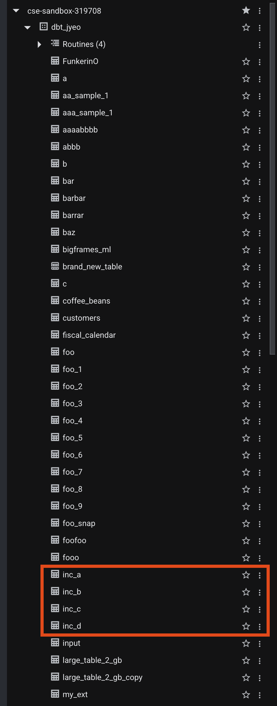
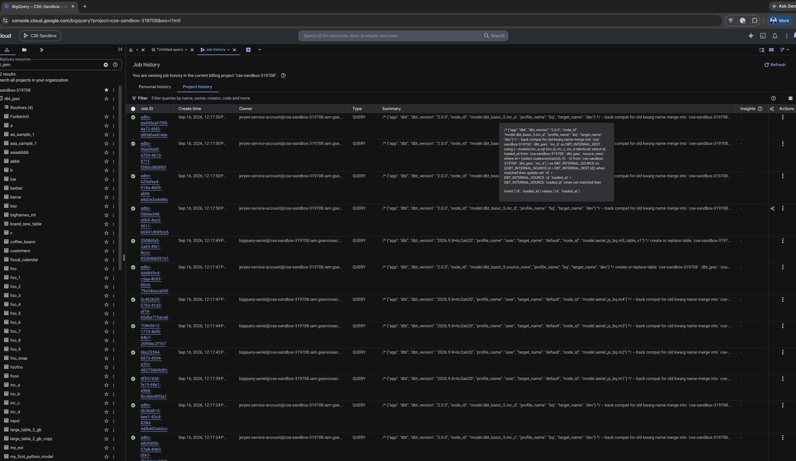
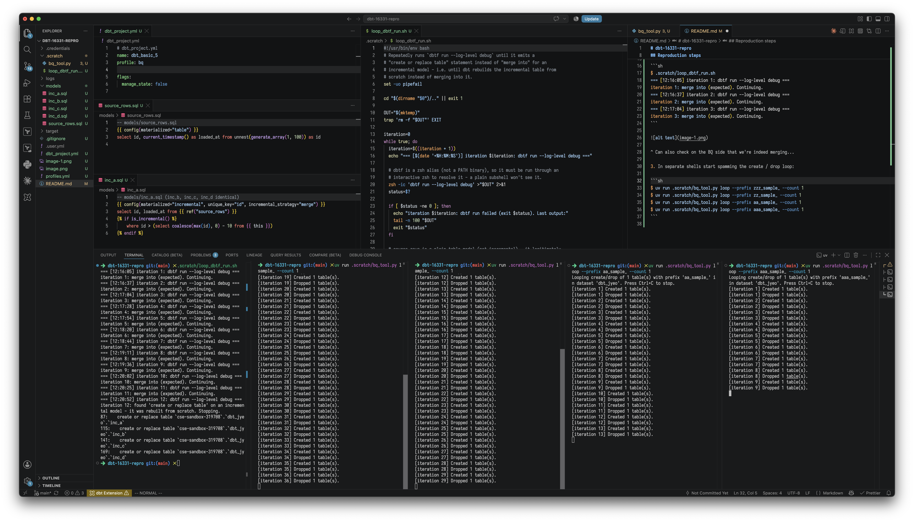
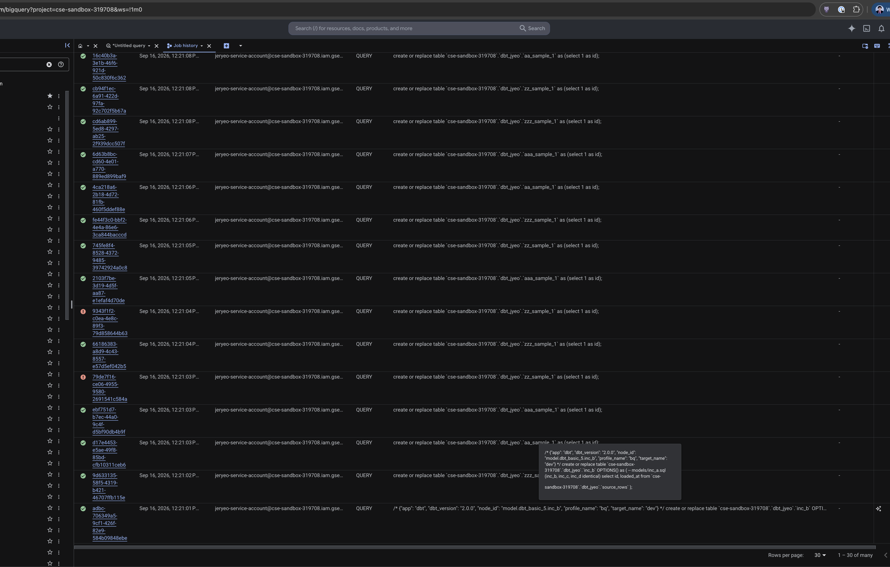

# dbt-16331-repro

Reproduces https://github.com/dbt-labs/dbt/issues/16331 on `dbt 2.0.2`

1. `.scratch/loop_dbtf_run.sh` - runs dbt in a loop until we see `create or replace ...` on the incrementals.
2. `.scratch/bq_tool.py` - used to spam creating and deleting tables from the dataset.

## Reproduction steps

> You need to get your own BQ credentials and set it up. See `profiles.yml` for example.

1. First, make sure that the incremental tables already exist on BQ so that dbt will issue `merge into` instead of `create or replace ...`:



2. Start our dbt invocation looper and observe a few interations where we're merging as expected:

```sh
$ .scratch/loop_dbtf_run.sh
=== [12:16:05] iteration 1: dbtf run --log-level debug ===
iteration 1: merge into (expected). Continuing.
=== [12:16:37] iteration 2: dbtf run --log-level debug ===
iteration 2: merge into (expected). Continuing.
=== [12:17:04] iteration 3: dbtf run --log-level debug ===
iteration 3: merge into (expected). Continuing.
```



^ Can also check on the BQ side that we're indeed merging...

3. In separate shells start spamming the create / drop loop:

```sh
$ uv run .scratch/bq_tool.py loop --prefix zzz_sample_ --count 1
$ uv run .scratch/bq_tool.py loop --prefix zz_sample_ --count 1
$ uv run .scratch/bq_tool.py loop --prefix aa_sample_ --count 1
$ uv run .scratch/bq_tool.py loop --prefix aaa_sample_ --count 1
```



^ Eventually, we will run into the race condition described and our orginal looper will create the incremental from scratch.



^ Can be confirmed by checking BQ history that we did indeed issue `create or replace ...` on the incremental.
